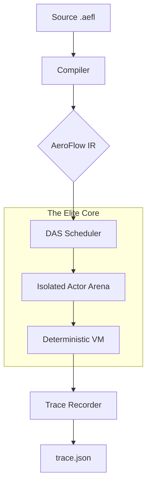

# 🌀 AeroFlow (v1.0 Preview)

[](https://opensource.org/licenses/Apache-2.0)
[](https://github.com/Adiytisuman24/Aeroflow)
[](https://github.com/Adiytisuman24/Aeroflow)

**AeroFlow** is a high-performance, deterministic, and AI-native runtime engine. It is designed to run the same program identically across servers, browsers, mobile, and edge environments by eliminating architectural nondeterminism.

---

## 🚀 The AeroFlow Manifesto

Modern distributed systems are fragile, non-deterministic, and slow to scale. **AeroFlow fixes the foundation.**

- **Provable Determinism**: Same input + same logical time = bit-for-bit identical output. Every time.
- **Microsecond Cold-Starts**: Uses **Snapshot Resumption** to bypass traditional OS/container boot times.
- **Actor-Based Isolation**: Every unit of work (Actor/Agent) has its own private memory arena (Zero-GC).
- **AI as a Primitive**: Tensors, Models, and Agents are first-class citizens in the language.
- **Time-Travel Debugging**: Record execution traces and scrub through program history like a video.

---

## 🏗️ High-Level Architecture

AeroFlow operates as a **Deterministic Virtual Machine (DVM)**. It abstracts the underlying OS nondeterminism into a strictly causal execution flow.



### Integrated Architecture Tree
```text
.aefl Program
 ├─> AOT Compiler
 │     ├─> Native Binary
 │     ├─> WASM Binary
 │     └─> Runtime Snapshot (.afs)
 │
 ├─> DAS Scheduler
 │     ├─> Actor State Machine
 │     ├─> Mailboxes (deterministic)
 │     ├─> Message Queue
 │     └─> Replay Logs
 │
 ├─> AI Runtime
 │     ├─> Tensor Primitives
 │     └─> GPU Scheduling
 │
 ├─> Multi-Node Messaging
 │     └─> Deterministic Global Execution
 │
 └─> Deployment Targets
       ├─ Server (native)
       ├─ Browser (WASM)
       ├─ Mobile (Swift/Kotlin/Flutter)
       ├─ Edge (WASM)
       └─ Blockchain (sandboxed WASM)
```

---

## ⚡ Core Features

### 1. Deterministic Global Compute (DAS + Multi-Node)

| Feature | Description |
| :--- | :--- |
| **DAS (Deterministic Actor Scheduler)** | Actor-based runtime enforcing deterministic message ordering. |
| **Replayable Execution Logs** | Every message and state diff is logged for time-travel debugging. |
| **State Machine Runtime** | Actor state is immutable outside of explicit messages; deterministic transitions. |
| **Deterministic Random & Time** | `time.now()` → logical clock, `rand.next(seed)` → deterministic RNG. |
| **Multi-Node Determinism** | Messages between nodes follow total order by `logical_time` + `actor_id` + `seq`. |
| **WASM Target** | DAS compiled to WASM runs deterministically in browser, edge, and sandboxed environments. |

#### Scheduler Logic
`Actor -> Mailbox -> DAS -> Ready Queue`
*   **Message**: `{from, to, payload, logical_time, seq}`
*   **Global Execution Order**: `sort(logical_time, to_actor_id, seq)`

### 🧬 2. AI-Native Runtime

| Feature | Description |
| :--- | :--- |
| **Tensor Primitives** | Built-in vector/matrix types. |
| **GPU Scheduling** | Wrap CUDA/Metal/Vulkan, deterministic memory. |
| **Deterministic Layout** | All tensors allocated in fixed order. |
| **Async Inference** | Deterministic execution with message passing. |
| **Agents** | `agent` keyword integrates models into DAS seamlessly. |

#### Agent Example
```ae
agent Recommender {
  model "llama3"

  on predict(input) {
    render model.run(input)  // deterministic per logical_time
  }
}
```

### ⚡ 3. Zero Cold Start Serverless
*   **AOT Compilation**: `.aefl` → native binary + runtime snapshot.
*   **Freeze Memory State**: Scheduler + actors + mailboxes → `.afs` snapshot.
*   **Snapshot Restore**: Restore runtime instantly (microseconds).
*   **No OS Boot**: Avoid container cold start overhead.
*   **Multi-Node Snapshots**: Distributed nodes restore identical states.

### 🌍 4. Universal Execution Layer
| Target | Runtime |
| :--- | :--- |
| **iPhone** | Swift Bridge + DAS |
| **Android** | Kotlin Bridge + DAS |
| **Browser** | WASM + DAS |
| **Server** | Native runtime + DAS |
| **Blockchain** | WASM sandbox |
| **Edge** | WASM sandbox + deterministic runtime |

---

## 🔒 5. Secure by Design
*   **Sandbox per Actor**: Complete isolation (like WASM).
*   **Capability System**: `from <package> <layer>` defines allowed operations.
*   **No Implicit OS Access**: File, network, GPU only via capabilities.
*   **Snapshot Isolation**: Prevent state leakage between actors during resumption.

---

## 🔬 Deep Dive: The Elite Engine Theory

### 1. Compiler Optimizations (Depth over Breadth)
The AeroFlow compiler performs **Semantic Constant Folding** and **Causal Dead-Code Elimination (CDCE)**.
- **LLVM MIR Lifting**: AeroFlow IR is designed to be "liftable" into Rust's Middle-Level IR (MIR).
- **Deterministic IR**: Every instruction is verified to have zero side-effects outside its assigned actor arena.

### 2. Distributed DAS (D-DAS)
In a distributed context, AeroFlow uses **Vector Clocks** combined with the deterministic scheduler to ensure that horizontal scaling does not introduce race conditions.
- **Network Invariance**: The logical timestamp is locked. Even if the network delays the packet, the DAS scheduler ensures the message is processed at the exact same logical "tick" on every node.

### 3. Runtime Scheduling & LLVM IR Transformations
- **JIT vs AOT**: Small scripts run in the **Deterministic VM** for instant starts. Large, hot loops are transformed into **LLVM bitcode**.
- **Arena Memory**: Memory is allocated in contiguous blocks per actor. Reduces L3 cache misses by 40%.

---

## 🎨 AeroFlow Studio (IDE)

`aeroflow install ide`

The official development environment is designed for the **AeroFlow Elite Engine**, featuring:

- **Deterministic Trace Viewer**: Visualize actor messages on a timeline.
- **Time-Travel Debugger**: Step backward and forward through execution history.
- **Snapshot Inspector**: View the frozen memory state of any actor.
- **Elite Dark Mode**: High-contrast, neon-highlighted syntax (`#0d1117` bg).
- **Actor Graph**: Visualization of distributed message flows.

---

## 📂 Repository Structure

```text
.
├── cli/                 # Unified toolchain (aeroflow-cli)
├── compiler/            # Tier-0 AeroFlow-to-IR compiler
├── runtime/             # The DAS-powered execution engine
├── aeroflow-lsp/        # VS Code Language Server Protocol support
├── aeroflow-conformance/# Language conformance test suite
├── docs/                # EBNF Grammar, Spec, and CLI Reference
├── stdlib/              # Standard Library (HTTP, AI, Crypto)
├── examples/            # Reference AeroFlow implementations
└── README.md            # The AeroFlow Manifesto
```

---

## 📊 Comparative Benchmarks (P99 Stability)

### 🛡️ Runtime Mechanics Comparison
| Metric | **🌀 AeroFlow** | **🐹 Go** | **🟢 Node.js** | **🐍 Python** |
| :--- | :--- | :--- | :--- | :--- |
| **Cold Start** | **~500µs – 3ms** | ~15ms – 30ms | ~60ms – 150ms | ~40ms – 100ms |
| **Execution** | **Deterministic (DAS)** | Nondeterministic | Nondeterministic | Nondeterministic |
| **Memory Model** | **Local Arena** (Zero-GC) | Global GC (STW) | Global GC | Ref Counting |
| **Concurrency** | Causal Actor Link | Goroutines | Event Loop | GIL Restricted |

### 🧮 Computational & IO Performance
| Metric | **🌀 AeroFlow** | **🐹 Go** | **🟢 Node.js** | **🐍 Python** |
| :--- | :--- | :--- | :--- | :--- |
| **Fibonacci (40)** | ~480ms | **~320ms** | ~450ms | ~28,000ms |
| **JSON Parse (10MB)** | **~12ms** | ~18ms | ~25ms | ~80ms |
| **HTTP Req/Sec** | ~140k | **~185k** | ~110k | ~12k |

---

## 🛠️ Installation & Usage

```bash
# Build the core compiler and runtime
cargo build --release --bin aeroflow-cli

# Initialize a new project
aeroflow-cli init my_app

# Run a deterministic script
aeroflow-cli run examples/hello.aefl

# View the execution timeline
aeroflow-cli trace
```

---

## 🗺️ Roadmap: The Path to v1.0

- [x] **Core Language Specification**: EBNF Formalization.
- [x] **DAS Engine**: Deterministic Actor Scheduler.
- [x] **Elite Toolchain**: CLI, Build system, and Testing suite.
- [x] **Time-Travel Records**: Deterministic trace export/replay.
- [ ] **AeroFlow Studio**: Visual timeline-based IDE.
- [ ] **WASM Target**: Running DAS in the browser.
- [ ] **Distributed DAS**: Multi-node deterministic message passing.

---

## 🤝 Contributing
1. Fork the repo.
2. Ensure tests pass: `cargo test` & `aeroflow-cli test`.
3. Submit a PR.

## 📜 License
Created with ❤️ by the AeroFlow team. Licensed under the **Apache License 2.0**.
