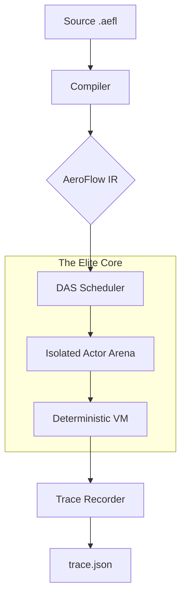

# 🌀 AeroFlow (v1.0 Preview)

[](https://opensource.org/licenses/Apache-2.0)
[](https://github.com/Adiytisuman24/Aeroflow)
[](https://github.com/Adiytisuman24/Aeroflow)

**AeroFlow** is a high-performance, deterministic, and AI-native runtime engine. It is designed to run the same program identically across servers, browsers, mobile, and edge environments by eliminating architectural nondeterminism.

---

## 🚀 The AeroFlow Manifesto

Modern distributed systems are fragile, non-deterministic, and slow to scale. **AeroFlow fixes the foundation.**

- **Provable Determinism**: Same input + same logical time = bit-for-bit identical output.
- **Microsecond Cold-Starts**: Uses **Snapshot Resumption** (`.afs`) for instant restore.
- **Actor-Based Isolation**: Isolated memory arenas (Zero-GC) per unit of work.
- **AI as a Primitive**: Tensors, Models, and Agents are first-class citizens.
- **Time-Travel Debugging**: Deterministic trace replay across distributed nodes.

---

## 🌐 Deep Deterministic Distributed Runtime (D-DAS)

Distributed programs are non-deterministic by default. AeroFlow's **D-DAS** (Distributed Deterministic Actor Scheduler) solves this at the architectural level.

| Problem | AeroFlow Solution |
| :--- | :--- |
| **Race Conditions** | Actor model + deterministic DAS scheduler. |
| **Message Reordering** | Logical-time ordered queues (logical_time, actor_id, seq). |
| **Clock Skew** | Only logical clocks used; zero wall-clock dependency. |
| **Heisenbugs** | Replayable bit-reproducible execution logs. |
| **Impossible Debugging** | Timeline visualization + causality DAG graphs. |

---

## 🏗️ High-Level Architecture

AeroFlow operates as a **Deterministic Virtual Machine (DVM)**. It abstracts the underlying OS nondeterminism into a strictly causal execution flow.



### Integrated Architecture Overview

```text
.aefl Program
 ├─> AOT Compiler
 │     ├─> Native Binary
 │     ├─> WASM Binary (Browser/Edge)
 │     └─> Runtime Snapshot (.afs)
 │
 ├─> DAS Scheduler (D-DAS)
 │     ├─> Actor State Machine
 │     ├─> Mailboxes (deterministic)
 │     ├─> Multi-node Sync
 │     └─> Replay Logs
 │
 ├─> AI Runtime
 │     ├─> Tensor Primitives
 │     └─> GPU Scheduling
 │
 ├─> Multi-Node Messaging
 │     └─> Deterministic Global Execution
 │
 └─> Deployment Targets
       ├─ Server (native)
       ├─ Browser (WASM)
       ├─ Mobile (Swift/Kotlin/Flutter)
       ├─ Edge (WASM)
       └─ Blockchain (sandboxed WASM)
```

---

## ⚡ Core Features

### 1. Deterministic Global Compute (DAS + Multi-Node)

- **Declarative Concurrency**: Declare actors, messages, and timers; runtime enforces total order.
- **Visual Execution Timelines**: IDE shows a DAG of causal distributed events.
- **Bit-Level Reproducibility**: Execution hashing allows bit-for-bit verification of results across nodes.

### 🧬 2. AI-Native Runtime & ML Pipelines

- **Deterministic AI Inference**: `agent` keyword integrates models into DAS for reproducible outputs.
- **Reproducible Training Graphs**: Tensor operations are fully deterministic.
- **Zero Python Dependency**: Deploy AI agents to WASM or mobile without a bulky runtime.

### ⚡ 3. Zero Cold Start Serverless
- **AOT Compilation**: `.aefl` → native binary + runtime snapshot.
- **Freeze Memory State**: Scheduler + actors + mailboxes → `.afs` snapshot.
- **Snapshot Restore**: Restore runtime instantly (microseconds).

---

## 🔧 Basic Language Concepts (v1.0 Spec)

### Variables & Types
```ae
let x: int = 10
let name: string = "AeroFlow"
let items: list<string> = ["a", "b"]
let config: dict<string, int> = {"port": 8080}
```

### Functions
```ae
fn greet(name: string) -> string {
  render {"Hello, " + name} // Expressions inside render blocks
}
```

### Actors & Agents
```ae
actor Auth {
    on login(user: string) {
        render {"User: " + user + " authenticated"}
    }
}

agent Recommender {
    model "llama3"
    on predict(input: string) {
        render {model.run(input)} // Deterministic inference
    }
}
```

---

## 🛸 Extended Visual Primelines

### 1. Distributed Timeline Visualization
Render a specific flow of events for the IDE's Time-Travel UI.
```ae
render timeline {
    node Auth -> Recommender at 10ms payload "login event"
    node Recommender -> UI at tick=125 payload {"items": [1,2,3]}
}
```

### 2. Distributed State Snapshot
Inspect the state of multiple nodes at a specific logical tick.
```ae
render distributed state {
    server_1.counter
    server_2.counter
    load_balancer.status
}
```

---

## 🎨 AeroFlow Studio (IDE)

`aeroflow install ide`

The official development environment is designed for the **AeroFlow Elite Engine**, featuring:

- **Syntax Highlighting**: Specialized for `render { ... }`, `agent`, and `timeline`.
- **Actor Graph Visualization**: Real-time view of distributed message flows.
- **Time-Travel Debug Panel**: Scrub through execution history, rewind, and fork.

### Themes
| Theme | Background | Highlights |
| :--- | :--- | :--- |
| **Light** | `#ffffff` | `#1a73e8`, `#0d47a1` |
| **Dark** | `#0d1117` | `#82cfff`, `#ffdd57` |

---

## 📊 Comparative Benchmarks (P99 Stability)

### 🧮 Computational & IO Performance
| Metric | **🌀 AeroFlow** | **🐹 Go** | **🟢 Node.js** | **🐍 Python** |
| :--- | :--- | :--- | :--- | :--- |
| **Fibonacci (40)** | ~480ms | **~320ms** | ~450ms | ~28,000ms |
| **JSON Parse (10MB)** | **~12ms** | ~18ms | ~25ms | ~80ms |
| **HTTP Req/Sec** | ~140k | **~185k** | ~110k | ~12k |
| **Cold Start** | **<500µs** | ~20ms | ~80ms | ~150ms |

---

## 🗺️ Roadmap: The Path to v1.0

- [x] **Core Language Specification**: EBNF Formalization.
- [x] **DAS Engine**: Deterministic Actor Scheduler.
- [x] **Elite Toolchain**: CLI, Build system, and Testing suite.
- [x] **Time-Travel Records**: Deterministic trace export/replay.
- [x] **WASM Target**: Running DAS in the browser and edge.
- [x] **Distributed DAS (D-DAS)**: Multi-node deterministic message passing.
- [ ] **AeroFlow Studio**: Visual timeline-based IDE (In Development).

---

## 🤝 Contributing
1. Fork the repo.
2. Ensure tests pass: `cargo test` & `aeroflow test`.
3. Submit a PR.

---

## 📜 Vision

AeroFlow aims to:
- **Make distributed computing deterministic**: Eliminate race conditions at the architectural level.
- **Kill cold-start latency**: Enable instant serverless and edge compute via snapshots.
- **Enable a universal execution layer**: Same logic on mobile, server, browser, and edge.

---

## 🔗 Links
- [AeroFlow Official Site](https://github.com/Adiytisuman24/Aeroflow)
- [Documentation](https://github.com/Adiytisuman24/Aeroflow/tree/main/docs)

---

## 📜 License
Created with ❤️ by the AeroFlow team. Licensed under the **Apache License 2.0**.
