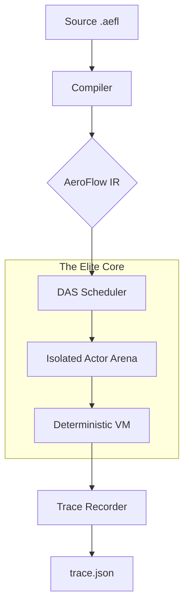

# 🌀 AeroFlow (v1.0 Preview)

[](https://opensource.org/licenses/Apache-2.0)
[](https://github.com/Adiytisuman24/Aeroflow)
[](https://github.com/Adiytisuman24/Aeroflow)

**AeroFlow** is a high-performance, deterministic, and AI-native runtime engine. It is designed to run the same program identically across servers, browsers, mobile, and edge environments by eliminating architectural nondeterminism.

---

## 🚀 The AeroFlow Manifesto

Modern distributed systems are fragile, non-deterministic, and slow to scale. **AeroFlow fixes the foundation.**

- **Provable Determinism**: Same input + same logical time = bit-for-bit identical output.
- **Microsecond Cold-Starts**: Uses **Snapshot Resumption** (`.afs`) for instant restore.
- **Actor-Based Isolation**: Isolated memory arenas (Zero-GC) per unit of work.
- **AI as a Primitive**: Tensors, Models, and Agents are first-class citizens.
- **Time-Travel Debugging**: Deterministic trace replay across distributed nodes.

---

## 📱 AeroFlow Mobile Ecosystem (The Future of Apps)

AeroFlow provides a **better-than-Flutter** mobile development experience by introducing **Deterministic UI Syntax**.

### 🎨 Logic & Mobile Syntax
```ae
screen LoginScreen {
    let userName: string = ""
    render {
        Text {"Enter Name:"}
        Input {bind: userName}
        Button {"Login", onClick: Auth.login(userName)}
    }
}
```

### 🏗️ Deterministic UI Runtime
Unlike React or Flutter, AeroFlow UI updates are strictly causal:
1. **User Event** (Click/Input) → **UI Actor**
2. **UI Actor** → **DAS Scheduler** (Assigns logical tick)
3. **DAS** → **Render Block** (Deterministic state update)
4. **Render Engine** → **Native View** (Bit-for-bit identical frames)

### ⚙️ LLVM Native Compilation
AeroFlow compiles `.aefl` source into optimized machine code for **Android (Kotlin/NDK)** and **iOS (Swift/LLVM)**:
- **AOT Performance**: Zero-overhead execution via LLVM bitcode transformation.
- **Deterministic Memory**: Fixed-layout arenas eliminate GC pauses and memory nondeterminism.
- **AI-on-Device**: Run agents with deterministic inference directly on the mobile GPU.

---

## 🌐 Deep Deterministic Distributed Runtime (D-DAS)

| Problem | AeroFlow Solution |
| :--- | :--- |
| **Race Conditions** | Actor model + deterministic DAS scheduler. |
| **Message Reordering** | Logical-time ordered queues (logical_time, actor_id, seq). |
| **Clock Skew** | Only logical clocks used; zero wall-clock dependency. |
| **Heisenbugs** | Replayable bit-reproducible execution logs. |
| **Simulation Sync** | Multi-node state replication via casual ordering. |

---

## 🏗️ High-Level Architecture



---

## 📦 Standard Library & Package Management (`from` syntax)
AeroFlow uses a modular dependency system with **Capability-Based Security**.

- `ui.core`: Deterministic UI widgets and layout engines.
- `ai.tensor`: Tensors, agents, and reproducible ML pipelines.
- `fintech`: Deterministic backtesting and trade simulation.
- `net`: Deterministic network simulation and packet replay.
- `db`: Secure, snapshot-able persistent storage.

---

## 📊 Comparative Benchmarks (P99 Stability)

### 🧮 Computational & IO Performance
| Metric | **🌀 AeroFlow** | **🐹 Go** | **🟢 Node.js** | **🐍 Python** |
| :--- | :--- | :--- | :--- | :--- |
| **Fibonacci (40)** | ~480ms | **~320ms** | ~450ms | ~28,000ms |
| **JSON Parse (10MB)** | **~12ms** | ~18ms | ~25ms | ~80ms |
| **HTTP Req/Sec** | ~140k | **~185k** | ~110k | ~12k |
| **Cold Start** | **<500µs** | ~20ms | ~80ms | ~150ms |

---

## 🗺️ Roadmap: The Path to v1.0

- [x] **Core Language Specification**: EBNF Formalization.
- [x] **DAS Engine**: Deterministic Actor Scheduler.
- [x] **Elite Toolchain**: CLI, Build system, and Testing suite.
- [x] **Time-Travel Records**: Deterministic trace export/replay.
- [x] **WASM Target**: Running DAS in the browser and edge.
- [x] **Distributed DAS (D-DAS)**: Multi-node deterministic message passing.
- [ ] **Mobile Runtime**: AOT compilation for iOS and Android.
- [ ] **AeroFlow Studio**: Visual timeline-based IDE.
- [ ] **Standard Library**: stable `ui.core` and `ai.tensor` modules.

---

## 🤝 Contributing
1. Fork the repo.
2. Ensure tests pass: `cargo test` & `aeroflow test`.
3. Submit a PR.

---

## 📜 Vision
AeroFlow aims to make distributed computing, mobile apps, and AI simulations **provably deterministic**. Eliminate the "it works on my machine" problem once and for all.

---

## 🔗 Links
- [AeroFlow Official Site](https://github.com/Adiytisuman24/Aeroflow)
- [Documentation](https://github.com/Adiytisuman24/Aeroflow/tree/main/docs)

---

## 📜 License
Created with ❤️ by the AeroFlow team. Licensed under the **Apache License 2.0**.
